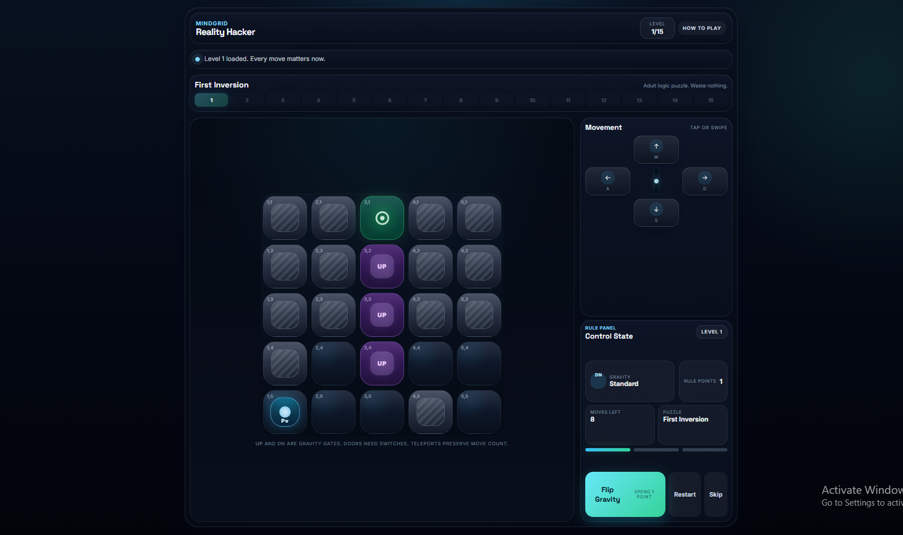
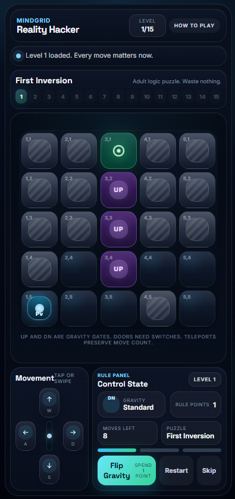
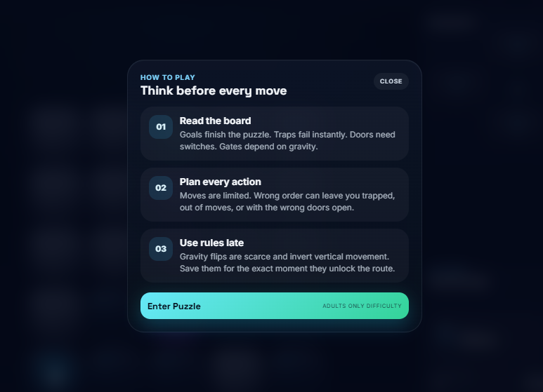

# MindGrid

MindGrid is a compact puzzle game built with React, TypeScript, and Vite. Each level is a logic board where movement is limited, gravity can be rewritten, and one bad sequence can lock the puzzle.

## What The Game Includes

- 15 handcrafted puzzle levels
- Gravity-flip mechanics powered by rule points
- Interactive board elements like doors, switches, traps, teleporters, and one-way tiles
- Keyboard controls (`WASD` / arrow keys) plus swipe support on touch devices
- First-run "How To Play" tutorial modal
- Progressive level unlocking with instant in-game feedback

## Gameplay Loop

1. Read the board and locate the goal.
2. Move carefully within the level's move limit.
3. Spend rule points to flip gravity when the route requires it.
4. Avoid traps and dead ends.
5. Clear the puzzle to unlock the next level.

## Tech Stack

- React 19
- TypeScript
- Vite
- Zustand-style external store pattern for game state

## Getting Started

```bash
npm install
npm run dev
```

Open the local Vite URL in your browser to play.

## Available Scripts

```bash
npm run dev
npm run build
npm run preview
npm run lint
```

## Project Structure

```text
src/
  components/      UI building blocks
  game/            level data and rule logic
  store/           central game state
  types/           shared TypeScript models
public/            static assets
```

## Screenshots

Add your screenshots in:

```text
docs/screenshots/
```

Recommended filenames:

- `docs/screenshots/gameplay-desktop.png`
- `docs/screenshots/gameplay-mobile.png`
- `docs/screenshots/how-to-play.png`

After you add them, paste this into the README wherever you want the gallery to appear:

```md
## Screenshots




```

If you want a cleaner GitHub layout, use this instead:

```html
## Screenshots

<p align="center">
  
</p>

<p align="center">
  
  
</p>
```


## Status

MindGrid is currently set up as a polished single-page puzzle experience with progression, responsive controls, and a custom game-state system.
